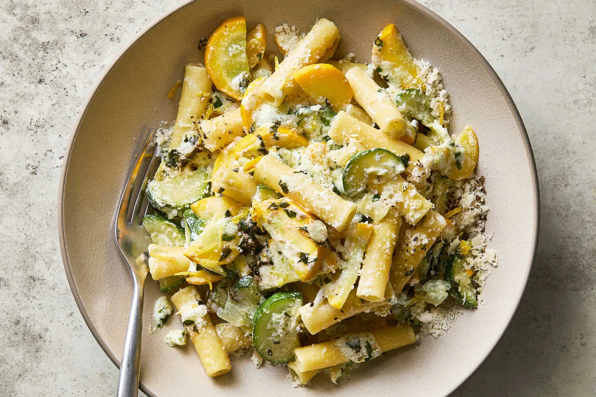

---
tags:
  - dish:main
  - ingredient:zucchini
  - ingredient:pasta
  - cuisine:italian
---
<!-- Tags can have colon, but no space around it -->

# Summer Pasta With Zucchini, Ricotta and Basil

<!-- Serves has to be a single number, no dashes, but text is allowed after the
number (e.g., 24 cookies) -->
- Serves: 4
{ #serves }
<!-- Time is not parsed, so anything can be input here, and additional
values can be added (e.g., "active time", "cooking time", etc) -->
- Time: 30 min
- Date added: 2025-09-07

## Description
A summer pasta should be simple and fresh, ideally made with vegetables straight from the garden or market. Look for the best artisanal ricotta; top-quality ingredients make all the difference here.

## Ingredients { #ingredients }

<!-- Decimals are allowed, fractions are not. For ranges, use only a single dash
and no spaces between the numbers. -->
- Extra-virgin olive oil
- 1 small onion, finely diced
- 2 pounds zucchini, sliced into ¼-inch-thick pieces (for larger zucchini, cut in half lengthwise before slicing)
- Salt and pepper
- 2 garlic cloves, minced, or 2 tablespoons chopped green garlic
- 1 ounce basil, about 2 cups loose leaves
- 1 pound ziti or other dry pasta
- 8 ounces ricotta, about 1 cup (see recipe)
- Pinch of crushed red pepper
- Zest of 1 lemon
- 2 ounces grated Parmesan, pecorino or a mixture, about 1 cup, plus more for serving

## Directions

<!-- If you have a direction that refers to a number of some ingredient, wrap
the number in asterisks and add `{.ingredient-num}` afterwards. For example,
write `Add 2 Tbsp oil to pan` as `Add *2*{.ingredient-num} to pan`. This allows
us to properly change the number when changing the serves value. -->
1. Put a pot of water on to boil. In a large skillet over medium-high heat, cook the onions in 3 tablespoons olive oil until softened, 5 to 8 minutes. Reduce heat as necessary to keep onions from browning. Add zucchini, season generously with salt and pepper, and continue cooking, stirring occasionally until rather soft, about 10 minutes. Turn off heat.
2. Meanwhile, use a mortar and pestle to pound garlic, basil and a little salt into a rough paste (or use a mini food processor). Stir in *3*{.ingredient-num} tablespoons olive oil.
3. Salt the pasta water well and put in the pasta, stirring. Boil per package instructions but make sure to keep pasta quite al dente. Drain pasta, reserving *1*{.ingredient-num} cup of cooking water.
4. Add cooked pasta to zucchini in skillet and turn heat to medium-high. Add *.5*{.ingredient-num} cup cooking water, then the ricotta, crushed red pepper and lemon zest, stirring to distribute. Check seasoning and adjust. Cook for 1 minute more. Mixture should look creamy. Add a little more pasta water if necessary. Add the basil paste and half the grated cheese and quickly stir to incorporate. Spoon pasta into warm soup plates and sprinkle with additional cheese. Serve immediately.

## Notes

<!-- Delete section if no additional notes -->

## Source

## Comments
